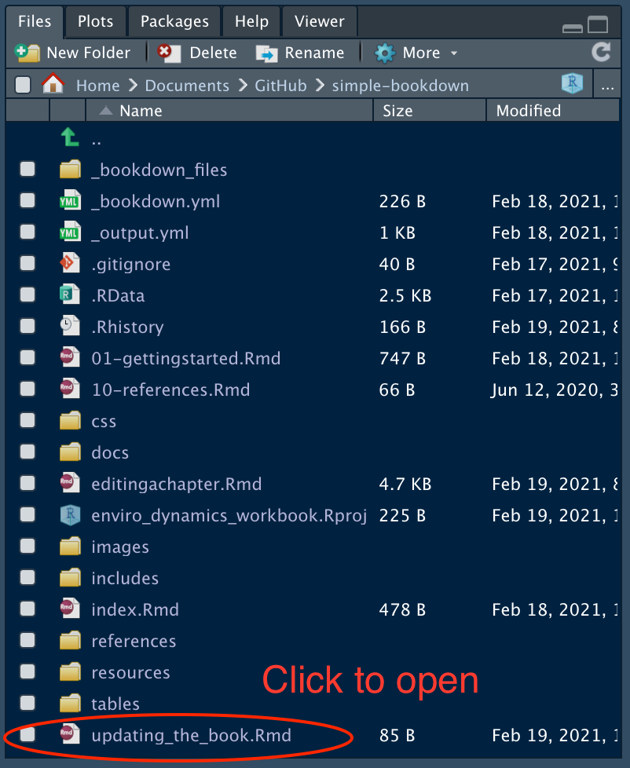
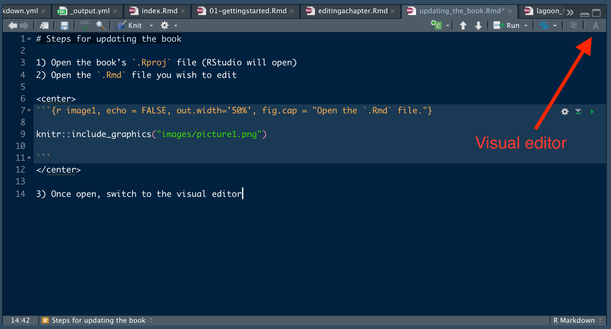
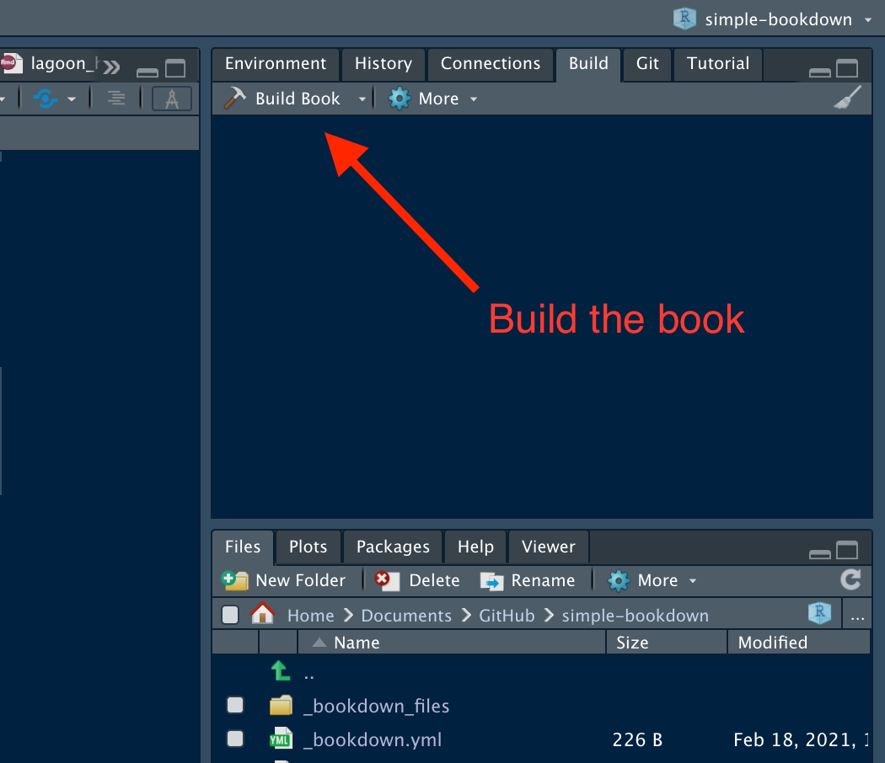
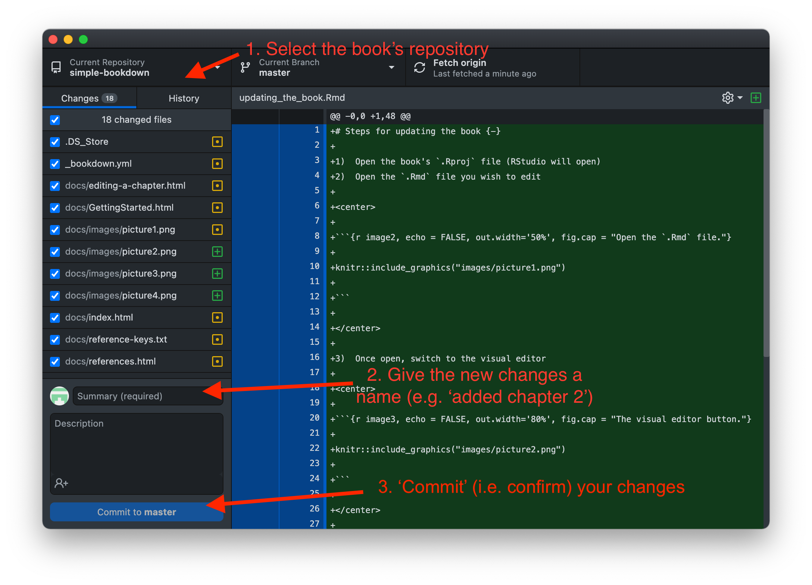
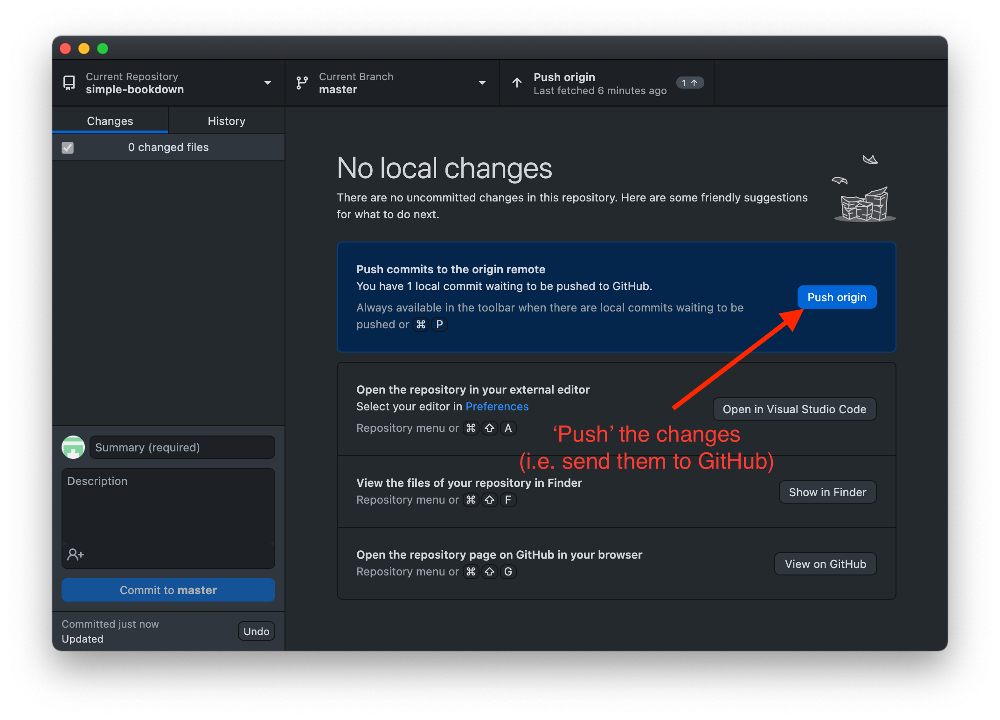

# Steps for updating the book {-}

1)  Open the book's `.Rproj` file (RStudio will open)
2)  Open the `.Rmd` file you wish to edit

<center>

```{r image2, echo = FALSE, out.width='50%', fig.cap = "Open the `.Rmd` file."}



```

</center>

3)  Once open, switch to the visual editor

<center>

```{r image3, echo = FALSE, out.width='80%', fig.cap = "The visual editor button."}



```

</center>

4)  Edit the chapter

5)  When finished, re-build the book

<center>

```{r image4, echo = FALSE, out.width='80%', fig.cap = "Building the book."}



```

</center>

6) Once built, a new window will open displaying the compiled book

7) When you're ready to update the website, open GitHub Desktop and select the book's repository 

<center>
```{r image5, echo = FALSE, out.width='85%', fig.cap = "Commit changes in GitHub Desktop"}



```
</center>

8) Add a description for the changes and commit them

9) Finally, push your changes to GitHub - the website will update in ~1 minute

<center>
```{r image6, echo = FALSE, out.width='85%', fig.cap = "Push the changes to update the website"}



```
</center>